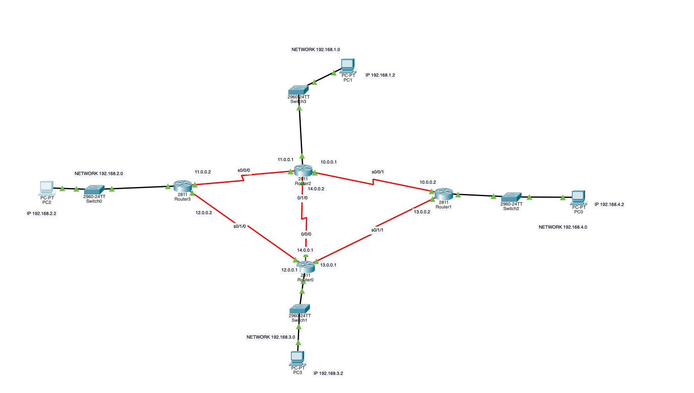
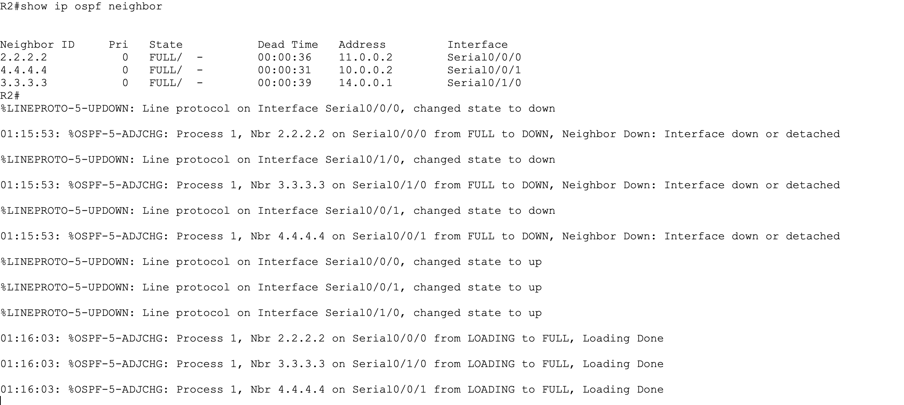
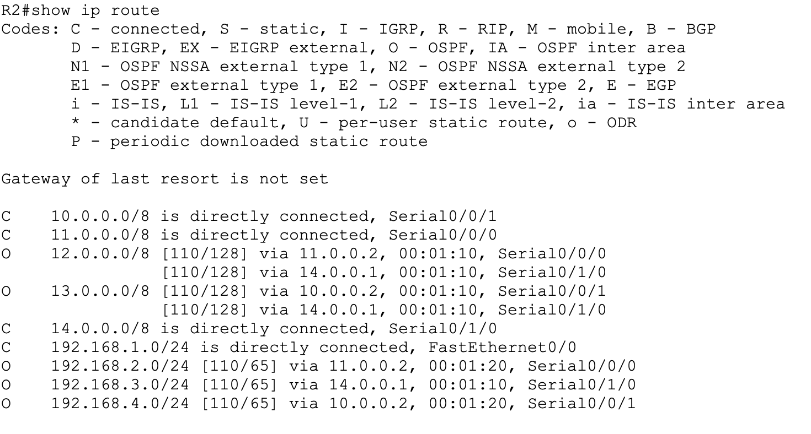
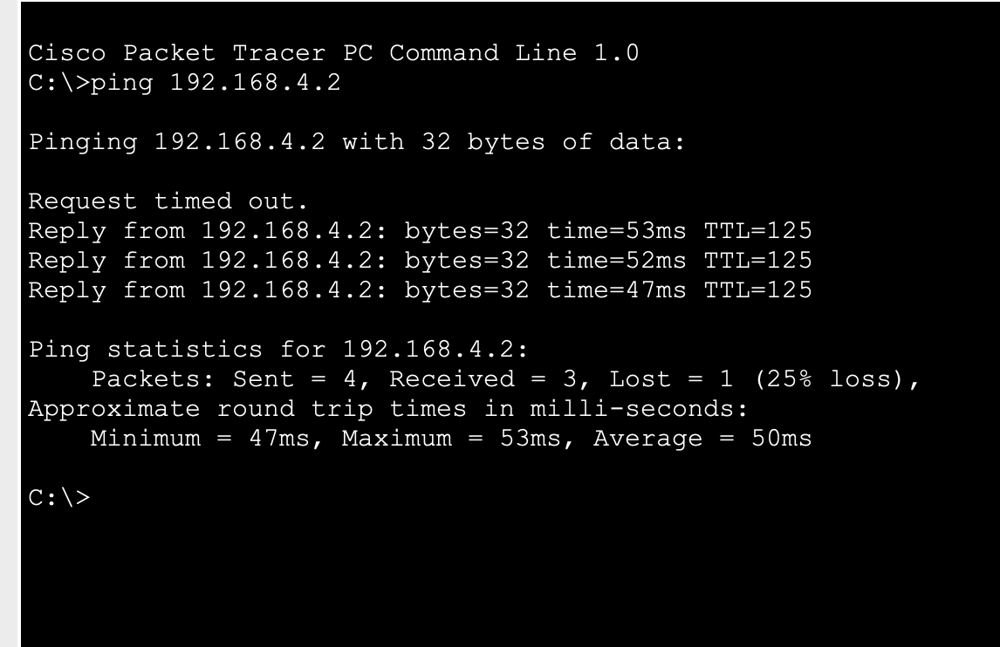
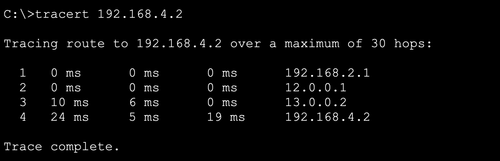

# 🌐 Enrutamiento dinámico OSPF en IPv4

## 📌 Descripción
En este proyecto se ha diseñado y configurado una red con varios routers utilizando el protocolo de enrutamiento dinámico OSPF en IPv4 mediante Cisco Packet Tracer.

La red está formada por múltiples redes LAN conectadas a diferentes routers y enlaces WAN entre routers. Se ha configurado OSPF para que todos los routers intercambien rutas automáticamente y exista conectividad entre todas las redes.

## 🗺️ Topología de red
La red está compuesta por:
- 4 routers
- 4 redes LAN (192.168.x.0)
- Enlaces serial entre routers
- Enrutamiento dinámico OSPF área 0
  
El objetivo es que todos los equipos de las distintas redes puedan comunicarse entre sí mediante rutas dinámicas.

## ⚙️ Configuración OSPF
Ejemplo de configuración en uno de los routers:
router ospf 1
router-id 1.1.1.1
log-adjacency-changes
network 192.168.1.0 0.0.0.255 area 0
network 11.0.0.0 0.255.255.255 area 0
network 14.0.0.0 0.255.255.255 area 0
network 10.0.0.0 0.255.255.255 area 0

## 🧠 Comprobaciones realizadas
Para verificar el funcionamiento de OSPF se han utilizado los siguientes comandos:

- show ip ospf neighbor
 

- show ip route

- ping entre redes

- traceroute

Se ha comprobado que todas las redes pueden comunicarse entre sí correctamente.

## 🛠️ Tecnologías utilizadas
- Cisco Packet Tracer
- Routing
- OSPF
- IPv4
- Redes LAN/WAN

## 🎯 Objetivos del proyecto
- Configurar enrutamiento dinámico OSPF
- Configurar router-id
- Establecer adyacencias entre routers
- Propagar rutas automáticamente
- Verificar conectividad entre redes
